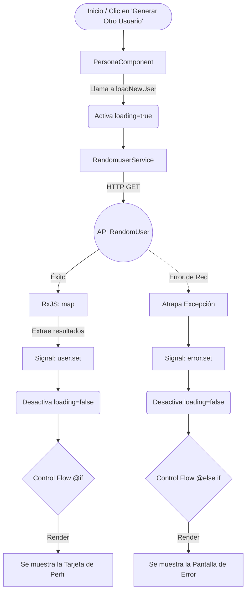

# Angular RandomUser Profiler

Una aplicación web desarrollada con **Angular 21** para consumir la API pública [RandomUser.me](https://randomuser.me/) y mostrar información de usuarios generados aleatoriamente en una interfaz de tarjeta (Card UI) moderna, responsiva y altamente profesional.

## Características Principales

- **Angular Signals:** Gestión de estado reactivo (usuario, estado de carga y manejo de errores) utilizando `signal()`.
- **Nuevo Control Flow:** Uso intensivo de la sintaxis `@if` y `@else if` para renderizar la interfaz de forma declarativa.
- **Standalone Components:** Arquitectura modular sin `NgModules`, importando dependencias como `DatePipe` de forma aislada.
- **UI Responsiva & Profesional:** Diseño adaptable con CSS puro utilizando Flexbox y CSS Grid. En dispositivos móviles se visualiza como una tarjeta vertical, mientras que en pantallas más amplias adopta una estructura a dos columnas (Sidebar y Contenido).
- **Control de Excepciones:** Manejo de errores de red (offline state) notificados a la interfaz sin romper la ejecución.

## Diagrama de Flujo de la Aplicación

El siguiente diagrama detalla cómo se maneja el ciclo de vida de los datos, desde la inicialización (o clic del usuario) hasta el renderizado de la UI:



## Estructura del Proyecto

* `src/app/models/user.model.ts`: Interfaces de TypeScript para tipar la respuesta de la API.
* `src/app/services/randomuser.service.ts`: Servicio inyectable que realiza peticiones HTTP.
* `src/app/components/persona/`: Componente standalone principal, el cual gestiona la vista de la tarjeta de perfil y su responsividad (CSS, HTML y TS).

## Requisitos y Configuración Local

1. Asegúrate de tener instalado [Node.js](https://nodejs.org/) (se recomienda la versión LTS) y Angular CLI globalmente.
2. Clona el repositorio e instala las dependencias:

```bash
npm install
```

3. Levanta el servidor de desarrollo local:

```bash
npm run start
```
*(Opcionalmente puedes usar `ng serve`)*.

4. Abre tu navegador web en `http://localhost:4200/`. La aplicación se recargará automáticamente si modificas algún archivo fuente.
